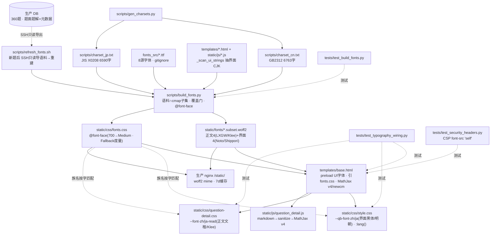

# 字体排版子系统 —— 开发文件关系图

> 2026-07-23 建立。字体排版期(自托管中日双语字体 + MathJax v4)的文件依赖与数据流。
> 图中箭头 = "被谁读取/驱动/引用";虚线 = 只读取值或按名匹配。

## 关键联系(文字版)

- **构建链**:`gen_charsets.py` 生成中日兜底字表 → `build_fonts.py` 把 [源字体 ∩ (语料 + 兜底)] 子集化成 woff2、并生成 `fonts.css`;`refresh_fonts.sh` 是新题后的幂等刷新入口(只读导生产语料再跑 build_fonts)。
- **语料两路**:正文字体喂题面题解语料 + 大兜底(懒加载);界面字体只喂元数据 + `_scan_ui_strings()` 扫描的模板/JS 文案(极小闭集,预加载)。**故改模板/JS 里的中日文会牵动界面字体子集**(见 refresh 脚本)。
- **消费链**:`base.html` 预加载界面字体、引 `fonts.css`、加载 MathJax v4(New Computer Modern + `mtextInheritFont`);`style.css`/`question-detail.css` 的 `:lang()` 令牌**按族名**引用 `fonts.css` 里的 @font-face(名字必须逐字一致);`question_detail.js` 走 markdown→MathJax v4 渲染。
- **服务**:woff2 与 fonts.css 由 nginx 直服 `/static/`(已含 woff2 mime、7d 缓存,零 sudo)。
- **红线**:文楷无真粗体→700 映射 Medium + `font-synthesis:none`;数学符号/emoji 不进 CJK 子集(交 MathJax/系统字体);`\text{}` 内转义 `\_`/`\&` 由 MathJax v4 原生处理(勿再改写)。
